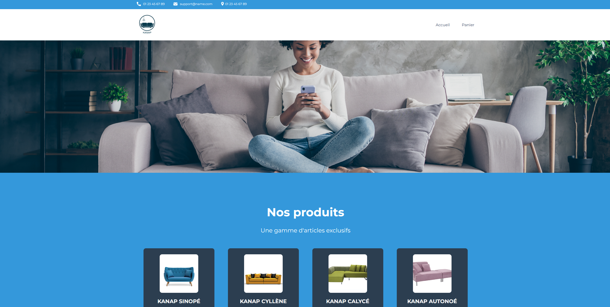

# Kanap #

languages : html/css | js

description : Création du front-end pour un site de vente de canapés, "Kanap"

- Créer un plan de test pour une application
- Valider des données issues de sources externes
- Interagir avec un web service avec JavaScript
- Gérer des événements JavaScript

